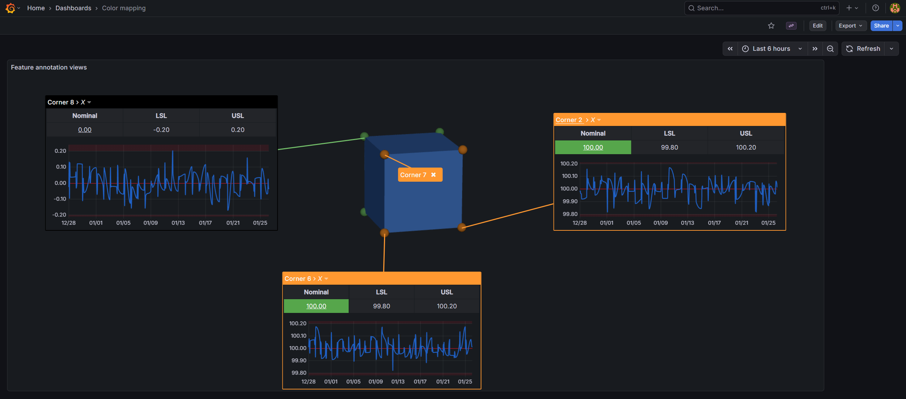

# SPC CAD Panel

[](./LICENSE)
[](https://grafana.com)

A Grafana panel plugin for visualizing 3D CAD models, point clouds, and metrology data within Grafana dashboards. Designed for quality control, manufacturing inspection, and metrology data visualization workflows.



## Features

- **Import CAD Models** - Load STL, 3MF, and PLY files directly into dashboards
- **Feature Annotations** - Add labels, tables, and time-series charts to geometric features
- **Template System** - 13 built-in templates for different feature types (point, circle, cylinder, etc.)
- **Color Coding** - Apply conditional colors to features based on measurement data
- **Interactive 3D View** - Rotate, pan, and zoom with trackball camera controls

## Documentation

- Adding CAD models (from URL or data source)
- Supported file formats (STL, 3MF, PLY, ASC)
- Features and characteristics configuration
- Annotations and the annotation editor
- Built-in templates (13 feature types)
- Point clouds and scan timelines
- 3D navigation and panel options

## Prerequisites

- **Grafana** version 11 or higher

## Quick Start

1. Install the plugin (see [Installation](./docs/cad-panel/installation.md))
2. Create a new panel and select "CAD" visualization
3. Add a CAD model path in panel options
4. Configure your data query with feature positions
5. Click features to create annotations

## Supported File Formats

| Format | Extension | Description |
|--------|-----------|-------------|
| STL | `.stl` | Stereolithography (binary/ASCII) |
| 3MF | `.3mf` | 3D Manufacturing Format |
| PLY | `.ply` | Polygon File Format |
| ASC | `.asc` | ASCII Point Cloud |

## Development

### Prerequisites

- Node.js (LTS version recommended)
- npm or yarn
- Grafana 11.0 or higher

### Setup

1. Clone the repository:
```bash
git clone https://github.com/KensoBI/spc-cad.git
cd spc-cad
```

2. Install dependencies:
```bash
yarn install
```

### Development Workflow

1. Start the development server with watch mode:
```bash
yarn run dev
```

2. In another terminal, start the development environment with Docker Compose:
```bash
docker compose up
```

This will start:
- Grafana on `http://localhost:3000` with the plugin pre-loaded
- PostgreSQL database on port `5444` with sample data

3. Access Grafana at `http://localhost:3000` and the panel will be automatically provisioned with dashboards and datasources

To stop the environment:
```bash
docker compose down
```

### Building

Build the plugin for production:
```bash
yarn build
```


## Getting Help

- [KensoBI Discord](https://discord.gg/cVKKh7trXU) - Community support
- Create an [issue](https://github.com/KensoBI/spc-cad/issues) to report bugs, issues, and feature suggestions.
- [KensoBI docs](https://docs.kensobi.com) - Documentation and resources

## License

This software is distributed under the [GNU Affero General Public License v3.0](./LICENSE).

## Copyright

Copyright (c) 2026 [Kenso Software](https://kensobi.com)
