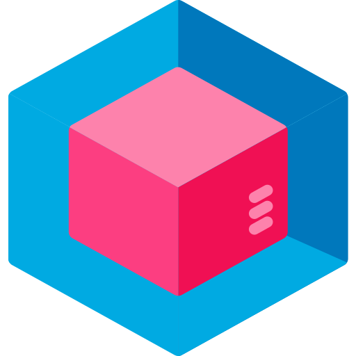

# KensoBI CAD Panel

[](./LICENSE)
[](https://grafana.com)

A Grafana panel plugin for visualizing 3D CAD models, point clouds, and metrology data within Grafana dashboards. Designed for quality control, manufacturing inspection, and metrology data visualization workflows.



## Features

- **Import CAD Models** - Load STL, 3MF, and PLY files directly into dashboards
- **Point Cloud Visualization** - Display scan data with gradient coloring based on deviation values
- **Feature Annotations** - Add labels, tables, and time-series charts to geometric features
- **Template System** - 13 built-in templates for different feature types (point, circle, cylinder, etc.)
- **Color Coding** - Apply conditional colors to features based on measurement data
- **Interactive 3D View** - Rotate, pan, and zoom with trackball camera controls
- **Scan Timeline** - Playback scan sequences over time

## Documentation

Full documentation is available in [docs/cad.md](./docs/cad.md), covering:

- Adding CAD models (from URL or data source)
- Supported file formats (STL, 3MF, PLY, ASC)
- Features and characteristics configuration
- Annotations and the annotation editor
- Built-in templates (13 feature types)
- Point clouds and scan timelines
- 3D navigation and panel options

## Prerequisites

- **Grafana** version 7.0 or higher
- **KensoBI Admin App** installed and enabled
- **Valid KensoBI License**

## Quick Start

1. Install the plugin (see [Installation](./docs/cad-panel/installation.md))
2. Create a new panel and select "CAD" visualization
3. Add a CAD model path in panel options
4. Configure your data query with feature positions
5. Click features to create annotations

## Supported File Formats

| Format | Extension | Description |
|--------|-----------|-------------|
| STL | `.stl` | Stereolithography (binary/ASCII) |
| 3MF | `.3mf` | 3D Manufacturing Format |
| PLY | `.ply` | Polygon File Format |
| ASC | `.asc` | ASCII Point Cloud |

All formats support gzip compression (`.gz`).

## Development

### Prerequisites

- Node.js >= 22 (< 25)
- Yarn 1.22+
- Docker and Docker Compose

### Setup

```bash
# Install dependencies
yarn install

# Start development mode with watch
yarn dev

# Start local Grafana server (separate terminal)
yarn server

# Open http://localhost:3000 (admin/admin)
```

### Available Commands

| Command | Description |
|---------|-------------|
| `yarn dev` | Build in development mode with watch |
| `yarn build` | Build for production |
| `yarn test` | Run tests with watch mode |
| `yarn test:ci` | Run tests once (CI mode) |
| `yarn lint` | Run ESLint |
| `yarn lint:fix` | Run ESLint with auto-fix |
| `yarn e2e` | Run end-to-end tests |
| `yarn server` | Start local Grafana Docker instance |

### Project Structure

```
src/
├── CadPanel.tsx              # Main panel component
├── module.ts                 # Plugin entry point
├── components/
│   ├── Scene/               # 3D rendering (Three.js)
│   ├── Annotations/         # Feature annotations
│   └── Editor/              # Panel option editors
├── feature/data/            # Data processing
├── templates/               # Template system
├── types/                   # TypeScript definitions
└── utils/                   # Utility functions
```

## Getting Help

- [KensoBI Discord](https://discord.gg/cVKKh7trXU) - Community support
- [Email Support](mailto:support@kensobi.com) - Bug reports and feature requests
- [KensoBI Website](https://kensobi.com) - Documentation and resources

## License

This software is distributed under the [GNU Affero General Public License v3.0](./LICENSE).

## Copyright

Copyright (c) 2023-2025 [Kenso Software](https://kensobi.com)
